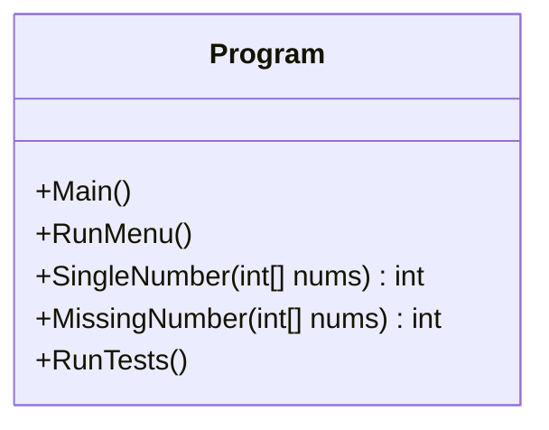

# 📘 Rovy Week 5 Challenge Labs  
MSSA – Algorithms & Data Structures  
Author: **Bobby Rovy**

---

# 🏷️ Badges

---

# 📌 Overview

This project contains the **Week 5 Challenge Labs** for MSSA Module 3.  
It includes two core algorithm problems implemented in C#:

### **1. Single Number (XOR Method)**  
Find the number that appears once when all other numbers appear twice.

### **2. Missing Number (Gauss Formula)**  
Find the missing number in the range `0..n` using the mathematical sum formula.

Both solutions include:

✔ Clean C# implementation  
✔ Instructor‑ready comments  
✔ Menu-driven console UI  
✔ Built-in test cases  
✔ Time/space complexity analysis  
✔ Whiteboard diagrams  

---

# 🧠 Whiteboard Explanations

## 📐 UML Class Diagram

Single Number (XOR Method)

XOR Rules:
a ^ a = 0
a ^ 0 = a
Order does not matter.

Example:
[4, 1, 2, 1, 2]

Walkthrough:
0 ^ 4 = 4
4 ^ 1 = 5
5 ^ 2 = 7
7 ^ 1 = 6
6 ^ 2 = 4

Answer = 4

Missing Number (Gauss Formula)

Expected sum = n * (n + 1) / 2

Example:
[3, 0, 1]

n = 3
Expected = 3 * 4 / 2 = 6
Actual = 3 + 0 + 1 = 4

Missing = 6 - 4 = 2

🧩 Time & Space Complexity
Single Number (XOR)
Operation	Complexity
Time	O(n)
Space	O(1)

Missing Number (Gauss)
Operation	Complexity
Time	O(n)
Space	O(1)

🖥️ How to Run
1. Open the project in Visual Studio
2. Press F5
3. Choose from the menu:

-Single Number
-Missing Number
-Run All Tests
-Exit

Program Flowchart
mermaid

flowchart TD
    A[Start] --> B[Display Menu]
    B --> C{User Choice}
    C --> D[Run Single Number] 
    C --> E[Run Missing Number]
    C --> F[Run All Tests]
    C --> G[Exit]
    D --> B
    E --> B
    F --> B
    G --> H[End]

 📂 Project Structure

Rovy Week5 Challenge Labs/
│
├── Program.cs
├── README.md
├── LICENSE
├── .gitignore
└── (bin/ and obj/ ignored)

🧪 Test Cases

Single Number Tests

[2,2,1] → 1
[4,1,2,1,2] → 4
[1] → 1

Missing Number Tests

[3,0,1] → 2
[0,1] → 2
[9,6,4,2,3,5,7,0,1] → 8

📝 Instructor Notes
This project demonstrates:

✔ Understanding of XOR bitwise operations
✔ Understanding of Gauss summation formula
✔ Clean C# implementation
✔ Menu-driven console UI
✔ Proper GitHub repo structure
✔ Professional documentation

📄 License

MIT License  
This project is licensed under the **MIT License**.

